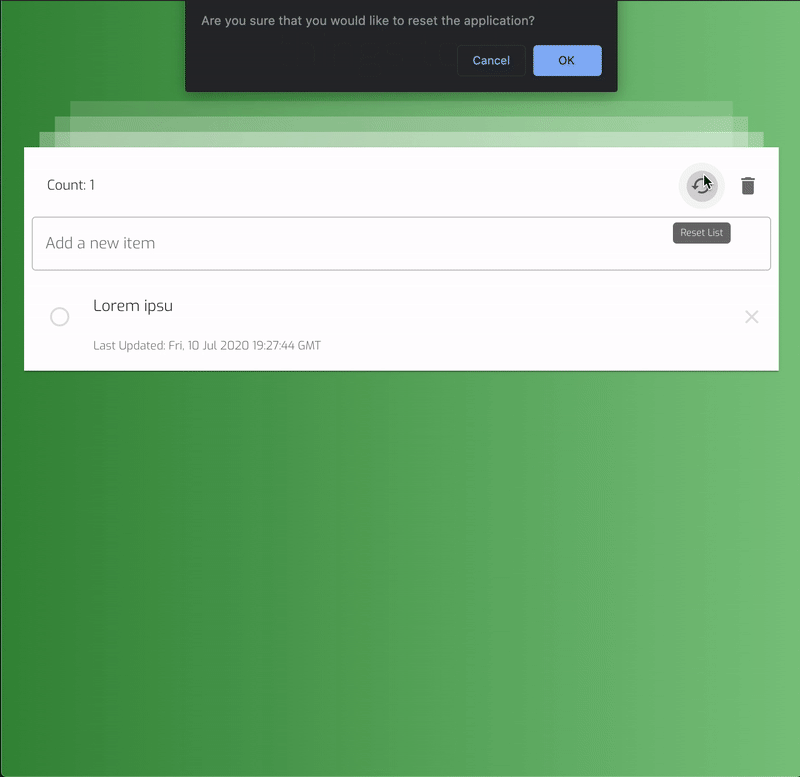
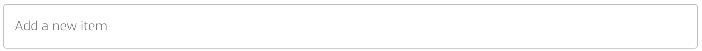
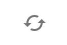

# 2Do List

### A simple, minimalist todo list.

This project was bootstrapped with [Create React App](https://github.com/facebook/create-react-app) and styled with [Material UI](https://material-ui.com/).

> Check out the demo: [Demo](https://bbaskett-2do-list.netlify.app/)

## Add items

Type in the item, press `Enter` to add

## Mark items as complete

Click the checkbox to the left of the item to mark as complete

## Delete items

Click `X` to the right of the item to delete it

## Restore Items

To restore any deleted items, click the `Trash` icon, then click the `Restore` item to the right of the items which you wish to restore

 

## Reset List

If you would like to start over, click the `Reset` button

